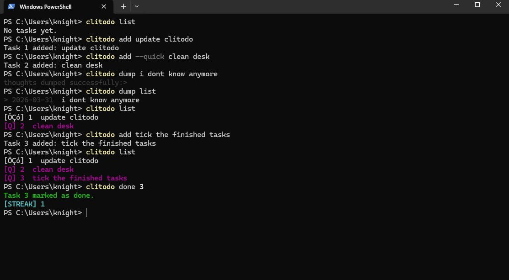
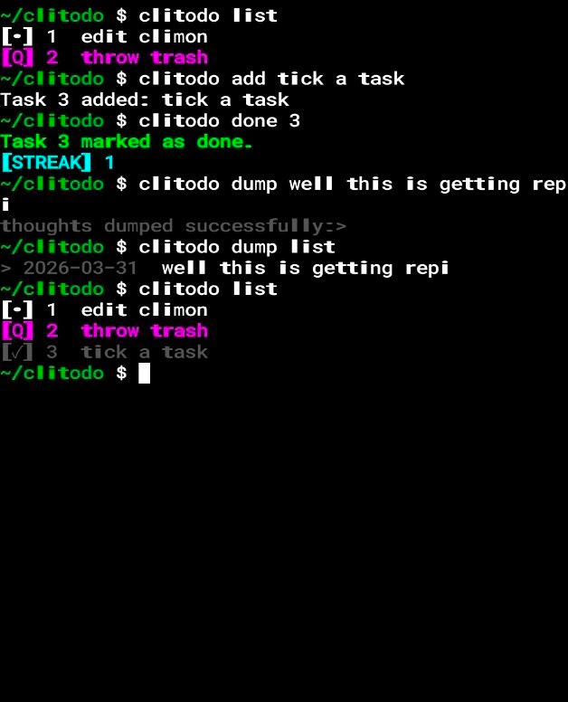

## Clitodo 
A fast, lightweight, and neuro-inclusive CLI task manager written in C.

It is a productivity utility designed to help manage executive dysfunction  by using visual salience, decision-support logic, and mental offloading.

 


### ✨ features
- **Weighted Random Pick:** ADHD-friendly logic that uses a weighted pool (3x weight for `--quick` tasks) to help overcome choice paralysis.
- **Visual Salience:** High-contrast ANSI colors and "dimmed" completion states to improve focus and reduce "wall of text" blindness.
- **Thought Dump:** A quick-capture system (`dump`) to offload mental clutter and "loops" without leaving the flow of work.
- **Gamified Streaks:** Persistent daily streak tracking to reward consistency.
- **File-Based Persistence:** Atomic file updates using temporary buffers to ensure data safety.
- **Cross-platform support:** you can use it from your linux machine (ubuntu), Windows and Android by using termux allowing you to carry your productive system in your pocket.
### 🧠 What I learnt? 
I deepened my understanding of **File I/O** by implementing a CRUD (Create, Read, Update, Delete) system. I practiced **Memory Management** by using `realloc` for dynamic weighted pools and prioritized **Memory Safety** by replacing `sprintf` with `snprintf`. I also learned how to handle **Linux Time Utilities** (`<time.h>`) to track dates and streaks across sessions.

### ⌨️  Usage:
#### Manual
you can access the manual by using both commands:
```
clitodo --help
# or
clitodo help
```
#### Installation 
#### Linux/Ubuntu
1. Clone the repository:
```
mkdir -p ~/.clitodo/repo
git clone https://github.com/oxtknight/clitodo.git ~/.clitodo/repo
cd ~/.clitodo/repo
```
2. Install globally (Ubuntu/Linux):
```
sudo make install
``` 
#### Windows
1. Install a C Compiler:
   Open PowerShell as **Administrator** and run this to install Chocolatey (package manager), then MinGW (the compiler):
   ```
   Set-ExecutionPolicy Bypass -Scope Process -Force; [System.Net.ServicePointManager]::SecurityProtocol = [System.Net.ServicePointManager]::SecurityProtocol -bor 3072; iex ((New-Object System.Net.WebClient).DownloadString('https://community.chocolatey.org/install.ps1'))
   # Restart PowerShell, then run:
   choco install mingw -y
   ```

2. Clone and Compile:
   ``` 
   mkdir "$HOME\.clitodo\repo -Force
   git clone https://github.com/oxtknight/clitodo.git "$HOME\.clitodo\repo"
   cd "$HOME\.clitodo\repo"
   gcc source.code/clitodo.c -o clitodo.exe
   ```

3. Make it a Global Command:
   Create a folder for your binaries and add it to your System PATH so you can type `clitodo` anywhere:
   ```
   mkdir C:\bin -Force
   move clitodo.exe C:\bin\
   $oldPath = [System.Environment]::GetEnvironmentVariable("Path", "User")
   [System.Environment]::SetEnvironmentVariable("Path", "$oldPath;C:\bin", "User")
   ```
   *Restart your terminal, and you are ready to go!*
#### Android (Termux) 
1. Update and install dependencies:
```
pkg update && pkg upgrade
pkg install git clang make -y
```
2. Clone and Build:
```
mkdir -p ~/.clitodo/repo
git clone https://github.com/oxtknight/clitodo.git ~/.clitodo/repo
cd ~/.clitodo/repo
make
```
3. Install globally to your Termux path:
```
cp clitodo $PREFIX/bin/
```
#### Update 
Clitodo is built to evolve and stay maintained.  
first, pre-requisite for updates, the repository must be cloned into your config folder:  
**Windows:** ``%USERPROFILE%\.clitodo\repo``  
**Linux/Termux:** ``~/.clitodo/repo``  
then use the command:
```
clitodo update
```

##### Commands:
 ```
clitodo add "Finish reviewing active" --quick
clitodo list
clitodo pick   # Let the app choose your focus
clitodo done 1
clitodo dump "I need to remember to check the stove"
```

### ✅ Future improvements
- priority system 
- timer mode
- reward system 
- idk probably something in this theme :>

